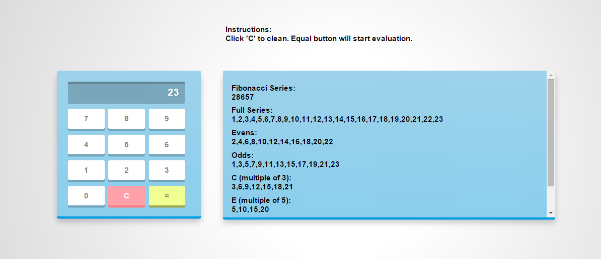
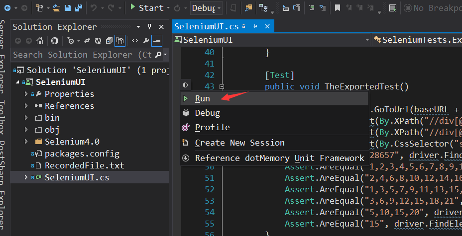
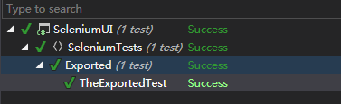

# Numeric-Sequence-Calculator
Numeric Sequence Calculator

## Instruction:
  This calculator can generate: 
  (all relation are inclusive)
  
    1. Generate full positive int series until a provided number. 
    
    2. Nth Fibonacci number
    
    3. All Even and Odd numbers until the provided number. 
    
    4. All number that is multiple of 3
    
    5. All number that is multiple of 5
    
    6. All number that is multiple of botn 3 and 5
    

=======
Example:

### Folder Structure
1. *WebAPI has MVC project and Unit test*
  
2. *SeleniumUI has end-to-end UI test using Selenium. Assume user have firefox and Selenium ide plugin installed.*
Otherwise, click here inside firefox to install: http://release.seleniumhq.org/selenium-ide/2.9.0/selenium-ide-2.9.0.xpi 

### How to run test
1. Open WebAPI project, Run it. Notice the port number may vary depends on each computer. Write down PORT number.
2. Open SeleniumUI project:
  - 2.1 If your dll reference is broken, you should all all the dll again, inside "SeleniumUI\Selenium4.0" folder e.g WebDriver.dll
3. Run all the test.
4. Check result in the broswer. Green means UI test passed.
 
Run UI test in vs2013:

UI test result:

If UI test fail, errors will be displayed in above picture.

**Credit:**
  front end resources download from: http://thecodeplayer.com/walkthrough/javascript-css3-calculator
  
